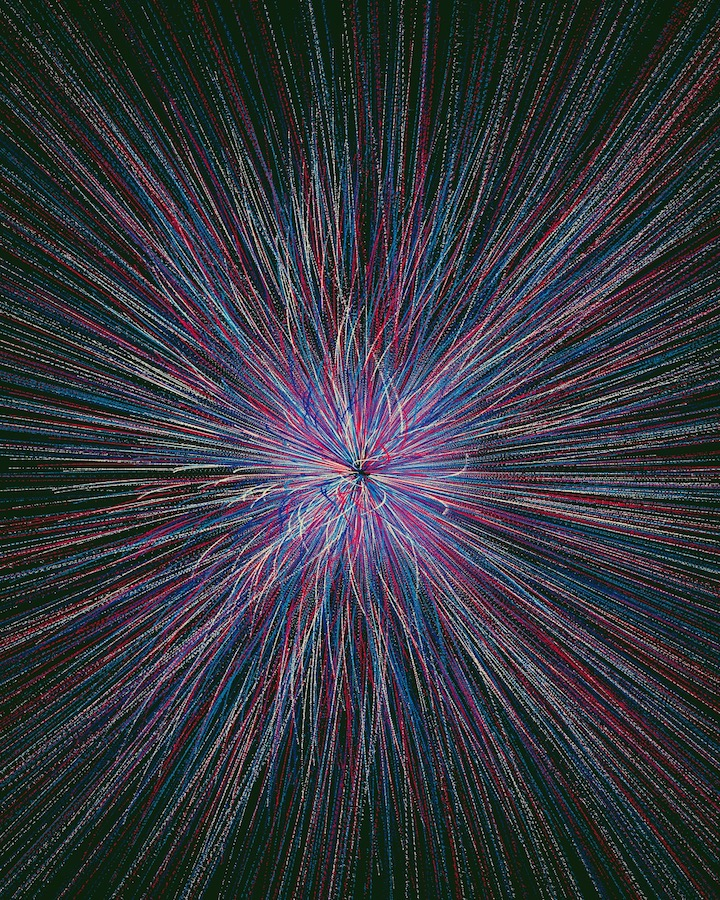
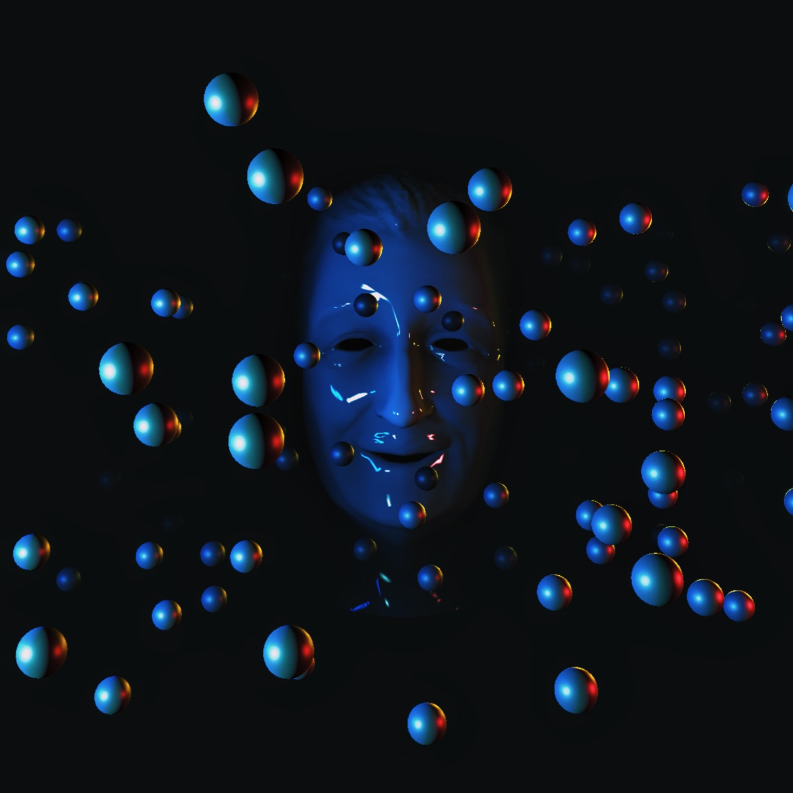
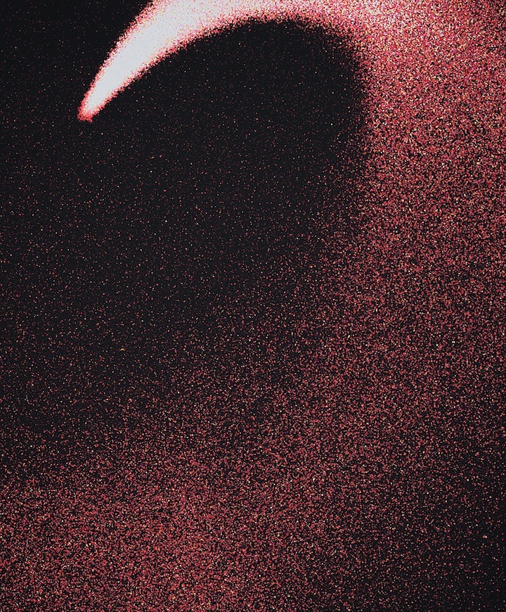
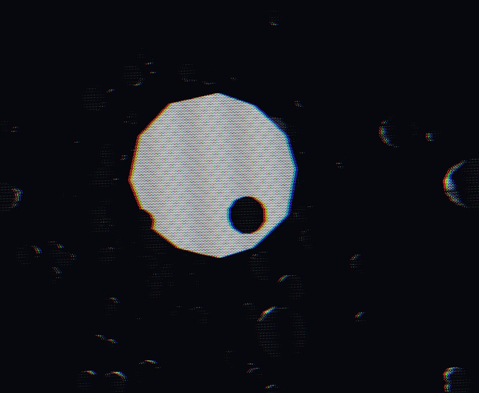

Learn new skills. Currently, much of my time has been spent with Three.js. But, I’ve also experimented with the web audio API and p5.js. Some stills & demos are below.

 
 

<iframe height='656' scrolling='no' title='Spread' src='//codepen.io/JacobDFrank/embed/apJZzb/?height=656&theme-id=light&default-tab=result&embed-version=2' frameborder='no' allowtransparency='true' allowfullscreen='true' style='width: 100%;'>See the Pen <a href='https://codepen.io/JacobDFrank/pen/apJZzb/'>Spread</a> by Jacob D Frank (<a href='https://codepen.io/JacobDFrank'>@JacobDFrank</a>) on <a href='https://codepen.io'>CodePen</a>.
</iframe>

 
 
 

####About
I began this work as a way to fill my spare time with new challenges. In the end, I may have spent several weeks working on this little experiment, creating 40+ pieces of content. It was inspired by creatives like Beeple as well as friends like Luka Schulz who confronted a similar challenge.   Please look at some of my work I’ve created. Some are bonafide failures, most are not. After all, you learn the most from failure, right?

 
 

<iframe height='656' scrolling='no' title='GLSL Cyclic Automata' src='//codepen.io/JacobDFrank/embed/GWVrOx/?height=656&theme-id=light&default-tab=result&embed-version=2' frameborder='no' allowtransparency='true' allowfullscreen='true' style='width: 100%;'>See the Pen <a href='https://codepen.io/JacobDFrank/pen/GWVrOx/'>GLSL Cyclic Automata</a> by Jacob D Frank (<a href='https://codepen.io/JacobDFrank'>@JacobDFrank</a>) on <a href='https://codepen.io'>CodePen</a>.
</iframe>

 
 
 

Recently I've been learning basic GLSL on my own, the best part is taking a break halfway through and playing around with the shaders.

 
 

 
 
 

 
 

<iframe height='656' scrolling='no' title='fragmentShader-One' src='//codepen.io/JacobDFrank/embed/oBZYXV/?height=656&theme-id=light&default-tab=result&embed-version=2' frameborder='no' allowtransparency='true' allowfullscreen='true' style='width: 100%;'>See the Pen <a href='https://codepen.io/JacobDFrank/pen/oBZYXV/'>fragmentShader-One</a> by Jacob D Frank (<a href='https://codepen.io/JacobDFrank'>@JacobDFrank</a>) on <a href='https://codepen.io'>CodePen</a>.
</iframe>

 
 
 

 
 
 

